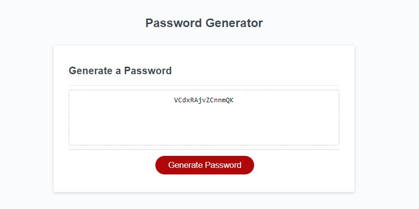

# Week_3_PasswordGenerator

## Description

Given starter code for the HTML section of a Password generating website I created the js file to generate the password. When a user clicks on the generate password button they are prompted to enter a length for the password then choose if they would like to include upcase letters, lowercase letters, numbers, and special characters. Based on their selection a password is generated for the user and displayed on the screen.

## Links

Link to repository - https://github.com/Daniel-robe/Week_3_PasswordGenerator
Link to deployed site - https://daniel-robe.github.io/Week_3_PasswordGenerator/

## Screenshots

